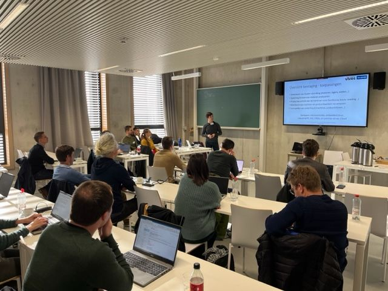

# MLOps4ECM Workshops

In this repo, you can find content for the workshops on Machine Learning Operations (MLOps).

This is part of the TETRA MLOps4ECM project. See the website: [https://mlops4ecm.be/](https://mlops4ecm.be/)

### Folders in this repo

* [edge-deployment/](edge-deployment/): Edge AI Deployment
* [generative-ai/](generative-ai/): Practical Generative AI
* [ml-infrastructure/](ml-infrastructure/): Building ML Infrastructure
