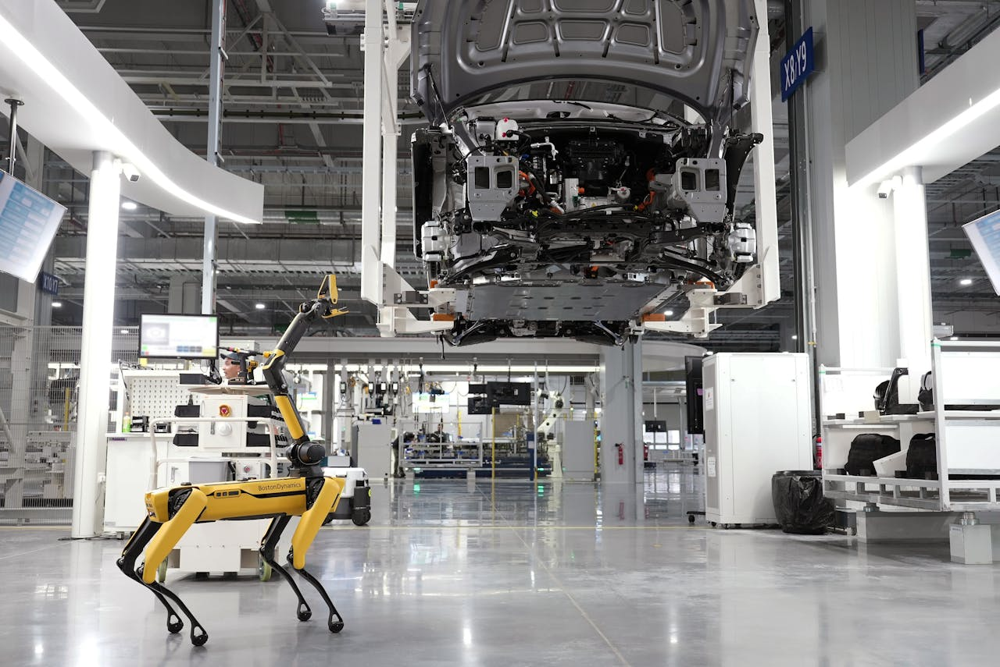

# Edge AI Deployment: Optimizing and Scaling AI Models on Devices

This workshop is part of the **"Edge AI Deployment"** course:

- 📚 Read the full [written guide](https://mlops4ecm.be/handleidingen/edge-deployment/) with detailed explanations
- 🎧 Listen to the [podcast series](https://mlops4ecm.be/handleidingen/edge-deployment/) for audio insight
- 📄 Download the [slide deck (PDF)](https://mlops4ecm.be/handleidingen/Edge%20AI%20Deployment.pdf) for a visual overview

Whether you're here to learn by coding, reading, or listening — you're covered.

## 🧭 Lab Overview

Welcome to the **Edge AI Optimization Workshop** — a practical, hands-on series of labs that introduces you to neural network deployment, inference, and optimization techniques for both embedded systems and powerful GPU servers.

Each lab builds on the last, guiding you through the process of deploying AI models in constrained environments while maximizing performance.

### Lab 01 – [First Steps with Ollama](01-first-steps-with-ollama/)

Run your first LLM and vision models on a ROCK 5B embedded device. Then compare to GPU inference on a server. Discover the limits of local AI execution and get familiar with prompt-based interactions.

### Lab 02 – [Grocery Classification with Pretrained Models](02-grocery-classification/)

Use pretrained multimodal models to classify real-world grocery images. Evaluate the effectiveness of prompt engineering and model selection — without any training required.

### Lab 03 – [Generate Synthetic Data with Diffusion](03-synthetic-data-generation/)

Use Stable Diffusion and large language models to augment your dataset. Focus on underrepresented grocery classes and explore how synthetic data can balance a real dataset.

### Lab 04 – [Train on Real + Synthetic Data](04-train-on-augmented-dataset/)

Train a convolutional model (e.g. MobileNet) on the combined real and synthetic dataset.

### Lab 05 – [Explore Whisper Model through ONNX](05-explore-whisper/)

Explore OpenAI's Whisper model, which uses a transformer architecture for audio transcription (audio to text). Try it out, learn about its structure, export parts of it to ONNX format, and visualize the model using Netron.

### Lab 06 – [Optimize Deployment with ONNX Runtime](06-deploy-whisper/)

Export the full Whisper model to ONNX format, including pre- and post-processing. Run inference from Python using only ONNX Runtime as a dependency. Next, we will deploy this model on our ARM board using only C++ and ONNX Runtime — no Python dependencies!

## 🚀 Goal of the Workshop

By the end of this workshop, you'll have:

- Run LLMs and vision models on embedded and server hardware
- Evaluated pretrained models on real-world data
- Used diffusion models for synthetic data generation
- Trained and optimized your own models for edge deployment (C++)
- Applied quantization to shrink models without sacrificing performance

You'll gain practical experience with tools and formats like **Ollama**, **Stable Diffusion**, **ONNX Runtime**, **Netron**, and **MobileNet** — all in the context of real, edge-oriented applications.

## 🛠️ Prerequisites

- Basic Python experience and some command-line confidence
- Familiarity with machine learning (e.g. training a CNN)
- No prior deep learning deployment experience required
- SSH access to a ROCK 5B device and a GPU server VM
