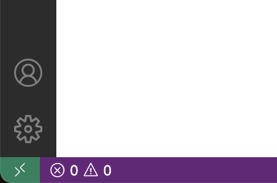
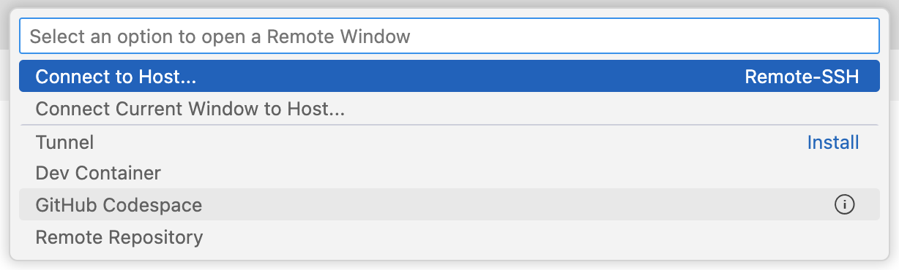
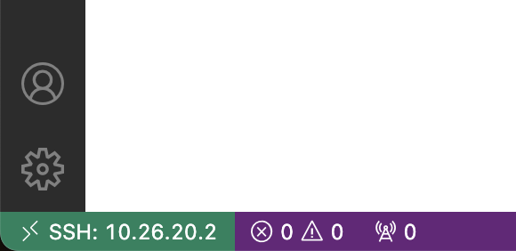
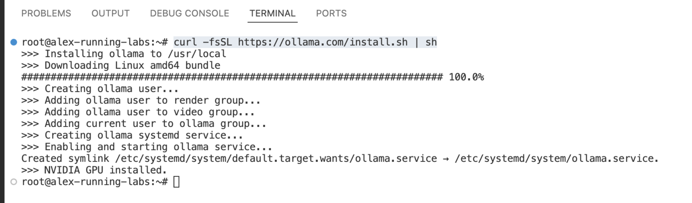

# 💻 Lab 1 – Run Your First Language Model

Welcome to your first lab in the **Practical Generative AI** workshop!

In this lab, you'll connect to your own virtual machine (VM), install a tool to run large language models (LLMs) locally, and start experimenting with your first AI-generated responses.

You'll also learn how to compare model sizes, measure performance, and explore the capabilities of modern open-source language models — all from the command line.

## ✅ What You'll Learn

- How to SSH into your VM using Visual Studio Code
- How to install and run [Ollama](https://ollama.com), a tool for running local LLMs
- How to use **Gemma 3**, Google's family of efficient open-source models
- How to evaluate and compare models using the `--verbose` flag

## 🧭 Step 1: Connect to Your Remote Machine

You'll be working on a virtual machine that has GPU support and can run language models locally.

### 1. Open Visual Studio Code

Make sure Visual Studio Code is installed on your laptop. Then open it and **click the green (or blue) button** in the bottom-left corner:



### 2. Select Remote SSH



A menu will pop up at the top. Choose:

```
Remote-SSH: Connect to Host...
```

Or  something similar, like 'SSH connection'.

### 3. Add a New SSH Host

If you don’t see your virtual machine listed yet, click:

```
* Add New SSH Host...
```

Then enter the IP address and username provided by your instructor. It will look something like this:

```
root@10.26.x.y
```

Replace `x.y` with your assigned IP address.

### 4. Confirm and Connect

When prompted:

- Click **Continue** to confirm the SSH fingerprint
- Enter the **password** of the virtual machine when asked
- If asked to choose the operating system, select **Linux**

### 5. You're In!



A new Visual Studio Code window should open. In the bottom-left corner, you should now see:

```
SSH: 10.26.x.y
````

This confirms you're connected to the remote machine 🎉

## 🖥️ Step 2: Open a Terminal

In your new VS Code window:

1. Click the **Terminal** menu at the top.
2. Select **New Terminal**.

This opens a terminal at the bottom of your screen, connected directly to your remote Linux VM.

## ⚙️  Step 3: Install Ollama



Ollama is a simple command-line tool that lets you run LLMs locally on your machine.

In the terminal, run this command:

```bash
curl -fsSL https://ollama.com/install.sh | sh
````

This installs Ollama and sets it up to run in the background. After the installation, you’ll be ready to generate text with a language model!

## 🤖 Step 4: Run Your First Model

Let’s try running a **small model** from the Gemma 3 family, developed by Google.

In your terminal, type:

```bash
ollama run gemma3:1b
```

After the model loads, type a prompt like:

```
Tell me a short bedtime story about a robot and a squirrel.
```

Try a few different prompts — even try to **trick the model** or make it generate something weird. It’s not very smart, because this is a very small model (only 1 billion parameters).

Exit the interactive chat with:

```
/exit
```

## 🌐 Step 5: Explore Other Models

Gemma 3 comes in different sizes — from fast and lightweight to large and powerful.

You can find the full list here:

🔗 [https://ollama.com/library/gemma3](https://ollama.com/library/gemma3)

Try running different versions by typing:

```bash
ollama run gemma3:4b
ollama run gemma3:12b
ollama run gemma3:27b
```

You can also try the **quantization-aware trained (QAT)** models, which have been trained to be more accurate, even for very small models:

```bash
ollama run gemma3:4b-it-qat
ollama run gemma3:12b-it-qat
ollama run gemma3:27b-it-qat
```

See how performance, output quality, and model size compare.

## 📊 Step 6: Measure Performance with `--verbose`

To understand how well your machine is handling the model, use the `--verbose` flag:

```bash
ollama run gemma3:4b-it-qat --verbose
```

You’ll see output like this:

```
prompt eval rate: 84.26 tokens/s
eval rate: 66.42 tokens/s
```

Try comparing different models and record their performance.

* Which one runs fastest?
* Which one gives the best answers?
* What’s the biggest model you can still run smoothly?

## 🎉 Done!

You’ve now:

* Connected to your GPU-powered virtual machine
* Installed Ollama on the command line
* Run your first language model
* Explored model size trade-offs
* Learned how to measure performance
