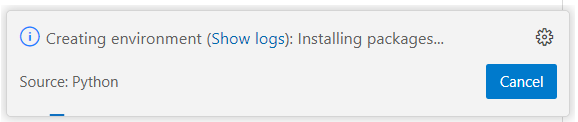

# 🧙 Lab 2 – Turn Your LLM into a Storyteller


In this lab, you'll build on what you learned in Lab 1 by experimenting with **system prompts** and **user prompts** — two powerful tools that let you control how a large language model responds.

You'll learn how to:
- Open and edit a Jupyter Notebook inside the Git repository
- Set up a virtual Python environment and install dependencies
- Write your own creative prompt to generate a story
- Modify the behavior of the model by changing the system prompt

By the end of this lab, you'll have your own **AI-powered storytelling assistant**, ready to generate vivid, imaginative narratives.

## ✅ Step 1: Connect to the Virtual Machine

Just like in Lab 1, open Visual Studio Code and **connect to your assigned virtual machine** via SSH.

💡 You can check you're connected by looking at the **bottom-left corner** of VS Code. It should display your VM’s IP address like `SSH: 10.26.x.y`.

## 📦 Step 2: Clone the Git Repository

Open a terminal in VS Code:

```
Terminal → New Terminal
````

Now clone the course repository by running:

```bash
git clone https://github.com/AlexanderDhoore/<date>-mlops-workshops.git
````

Replace `<date>` with the actual date of your workshop.

This will download all course materials to your virtual machine.

## 📂 Step 3: Open the Repository Folder

In VS Code:

1. Go to the **File** menu
2. Click **Open Folder…**
3. Choose the newly cloned folder:

```
/root/<date>-mlops-workshops/
```

4. Click **OK**
5. If prompted, confirm that you **trust the authors**

You should now see the project files in the left-hand panel.

## 📓 Step 4: Open the Storytelling Notebook

In the left panel:

1. Open the folder `generative-ai/02-storytelling-assistant/`
2. Double-click the file called:

```
storytelling-assistant.ipynb
```

This will open the Jupyter notebook for Lab 2.

## ⚙️ Step 5: Set Up Your Python Environment



At the top of the notebook, click the **"Run All"** button.

⚠️ The first time you run the notebook, VS Code will ask you to:

1. **Install Python and Jupyter extensions** → Accept
2. **Select a kernel** → Choose **Python environment**
3. **Create a new environment** → Select **Venv**
4. **Pick a Python interpreter** (e.g. Python 3.11)
5. **Install dependencies** → Choose `02-storytelling-assistant/requirements.txt` and click **OK**

VS Code will now create a virtual environment and install the required packages. Wait until this is done — you'll see progress in the bottom-right corner.

## ✏️ Step 6: Enter Your Story Prompt

Inside the notebook, find the section that looks like this:

```python
system_prompt = "You are a storyteller. Always reply with stories full of imagination and emotion."

# TODO: Enter your own creative story idea here!
user_prompt = ""  # ← Fill this in
```

📌 The **system prompt** tells the model how to behave. It’s already set to make the model act as a storytelling assistant.

✍️ Your task now is to fill in the `user_prompt` with your own creative idea.

Examples:

* `"A lonely robot discovers a hidden forest village."`
* `"An astronaut finds a message in a bottle on Mars."`

Then run the cell (or click **Run All**) to generate your story!

## 🎭 Step 7: Customize the System Prompt

Now that you’ve seen how the model responds, let’s go one step further.

Try modifying the `system_prompt` to:

* Always tell **sci-fi** or **fantasy** stories
* Use a specific **tone** (e.g. dramatic, silly, poetic)
* Speak as a **character** (e.g. a wizard, a pirate, or even a talking squirrel)

Some ideas:

```python
system_prompt = "You are a science fiction writer who specializes in dystopian futures. Always reply..."

system_prompt = "You are a wise old wizard who tells fairy tales full of magical lessons. Always reply..."
```

Run the notebook again and see how the storytelling changes.

## 🏁 Done!

You’ve now:

* Explored system and user prompts
* Used a real LLM in a Jupyter Notebook
* Customized the tone, style, and content of the generated stories

You’re well on your way to building your own creative applications with generative AI.
