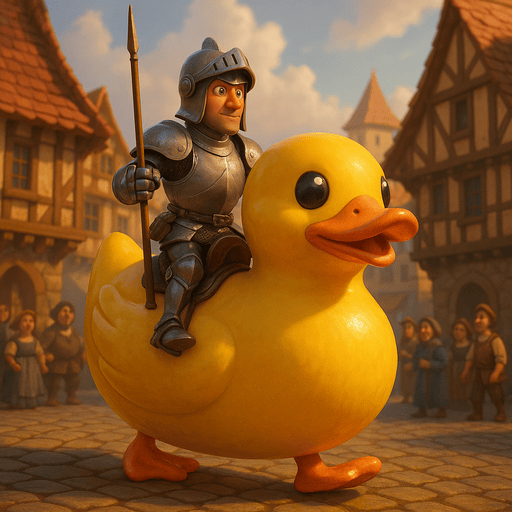

## 🖼️ Lab 5 – Illustrate the Story with Generated Images



In this lab, you'll bring your storytelling assistant to life by adding **AI-generated images**. You've already built a system that can write multi-part stories — now it's time to make them **visual**.  

You'll use a **diffusion model** to generate images from text prompts, first in isolation, and then as part of a complete, multimodal storytelling pipeline.

### 🧭 What You'll Learn

- How to run a **diffusion-based image generation model**
- How to experiment with key parameters like **steps** and **scale**
- How to **automatically generate images** from your chapter text
- How to combine language and vision models in one seamless loop

## 🧪 Part 1 – Generate Images from Prompts

### 🔹 Notebook: `image-generation.ipynb`

In this first notebook, you'll experiment with a **Stable Diffusion 3** model that generates images from text prompts. This helps you understand how diffusion works and what kind of prompts give the best visual results.

### ✅ What to Do

1. **Open the notebook**:

```
generative-ai/05-generated-images/image-generation.ipynb
````

2. **Write your own prompt** for the image you'd like to generate:

```python
prompt = "A small android robot in a forest, Pixar-style"
````

3. **Adjust the parameters**:

   * `steps`: number of inference steps (try 10–40)
   * `scale`: guidance strength (try 1–10)

   These influence how detailed and how faithful the output is to your prompt.

4. **Run the cell** to see the generated image.

5. At the bottom of the notebook, you’ll find a **reference grid** that shows what happens when you vary `steps` and `scale`.
   👉 You don’t need to edit this — just study the results to understand the effects.

### 💡 Explore

Try different styles in your prompt like:

* `"in the style of Van Gogh"`
* `"3D render, cinematic lighting"`
* `"dark fantasy concept art"`

See how prompt wording changes the output!

## ⚠️ GPU Memory Warning – How to Fix CUDA Errors

Running diffusion models requires a lot of GPU memory — and your virtual machine has **20 GB of VRAM**, which is good, but not unlimited.

If you open **multiple notebooks** in VS Code (even if you close the tabs), the Python processes behind them **can stay active** in the background. This can cause `CUDA out of memory` errors when trying to load a new model.

### 🛠️ What to Do If You Get CUDA Errors

If you see an error like:

```
OutOfMemoryError: CUDA out of memory.
```

The simplest solution is:

```bash
pkill python
```

This will **kill all Python processes**, including any that are still using GPU memory.
After that, just **reopen your notebook** and re-run the cells.

If that still doesn't work, try killing ollama as well:

```bash
pkill ollama
```

### 🧠 Bonus: Monitor GPU Memory

You can check your current GPU usage using:

```bash
nvidia-smi
```

This will show you:

* How much GPU memory is being used
* Which processes are using the GPU
* How much power the GPU is using
* Etc...

## 🖋️ Part 2 – Generate Images Alongside Your Story

### 🔹 Notebook: `story-with-images.ipynb`

In this second notebook, you'll **combine story generation with image generation**. For each chapter of the story, your code will:

* Generate the text
* Then generate a **matching image**

This makes your storytelling assistant fully **multimodal**.

### ✅ What to Do

1. **Open the notebook**:

   ```
   generative-ai/05-generated-images/story-with-images.ipynb
   ```

2. At the top of the notebook, write your own creative story idea:

   ```python
   story_idea = "A robot tries to become a pastry chef"
   ```

3. The notebook will:

   * Generate a **table of contents** (5 parts)
   * Write each chapter, one by one
   * Display the story as nicely formatted Markdown
   * **But first... you need to fix the image prompt!**

### 🎯 The Core Challenge: Create a Good Image Prompt

Each chapter is just text. To generate an image, you must **extract or generate a short, visual prompt**. The diffusion model only supports prompts up to **77 characters**, so long chapters won’t work directly.

You'll see this code:

```python
image_prompt = ""  # TODO: Replace this with your own logic!
```

### 💡 Tips

Try one of these strategies:

* Use the start of the chapter:

  ```python
  image_prompt = chapter_text[:77]
  ```
* Use the first sentence:

  ```python
  image_prompt = chapter_text.split(".")[0]
  ```
* **Best option**: Use the LLM again to turn the text into a visual description.
  Example:

  > "Describe this scene in one line for a text-to-image model. Keep it visual and under 77 characters."

Once you’ve set the `image_prompt`, the notebook will generate an image for each chapter and display it below the text.

## 🎉 What You’ll End Up With

By the end of Lab 5, you’ll have:

* A **multi-part story** written by your AI
* A **matching image** for every chapter
* A full, multimodal storytelling pipeline that you created yourself

## 🔍 Explore Further

* Play with **different story ideas** to see what visuals you get
* Use style tags like `"comic book style"` or `"watercolor painting"`
* Try writing more specific image prompts for each chapter
* Tweak model parameters (e.g. resolution, steps) to get different results
