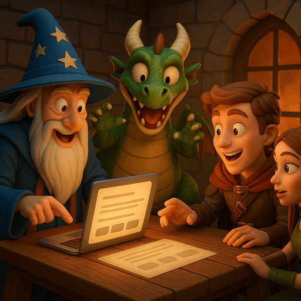

# 🧙 Lab 7 – Interactive Storytelling App with Choices



In this lab, you’ll take the storytelling system you’ve built and turn it into a **playable web app**.  
The story unfolds **one chapter at a time**, and after each chapter, the app shows you **three possible directions**. You choose what happens next — like a text-based role-playing game.

The app is built using **Gradio**, and runs on your own **virtual machine**.

### ✅ Getting Started

1. Make sure you're connected to your **virtual machine** using **Visual Studio Code + Remote SSH**  
   (Just like in all previous labs)

2. Open the notebook or script in this folder:

```
generative-ai/07-interactive-app/interactive-story.ipynb
````

## 🔍 What the Code Does

This app is structured as a **loop**:
- The user starts by entering a **story idea**
- The app asks a **language model** to write the first chapter and three choices
- The user picks an option
- The app continues the story and shows three more options
- This repeats forever, creating a branching, user-guided story

### 🧱 Code Overview

- `context["story"]`: keeps track of everything that’s happened so far
- `start_story(...)`: initializes the story with the user’s idea
- `continue_story(...)`: asks the LLM to continue the story and provide three new choices
- `launch_app()`: builds the Gradio user interface
  - Includes three buttons for choosing options
  - Each button click updates the story

## 🛠️ Your Task

Before the app can run, you need to **fix one line of code**.

Find this line:

```python
# 🛠️ TODO: Call the language model using ollama.chat
response = ollama.chat(...)
````

Replace it with the actual call to `ollama.chat`, using a system prompt and user prompt — just like you’ve done in previous labs.

Once you complete that line, save the file and run it.

## 🌐 Run the App

Launch the script in VS Code, then open your browser and go to:

```
http://<your-ip>:8080
```

You’ll see:

* A box to enter your story idea
* A button to start
* New chapters and choices will appear after every click

Try it out!

## ✨ Bonus Challenge – Add Image Generation

Try extending the app to also generate an **image for each chapter** using the **Stable Diffusion** pipeline you used in Lab 5.

You could:

* Extract a short visual description from each chapter (e.g. first sentence)
* Pass that into the diffusion model
* Display the image below the story

This would turn your text-based game into a **multimodal interactive experience**!

## 🎉 You Did It!

By completing this lab, you’ve:

* Built a real-time AI-powered web app
* Created a persistent, interactive storytelling loop
* Combined large language models with user-driven logic

You’re now ready to design your own interactive AI tools.
