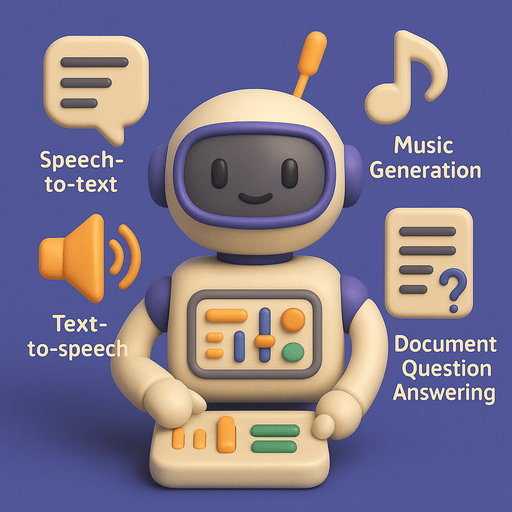

# 🎛️ Lab 8 – Explore Other Modalities



In this final lab, you’ll broaden your generative AI toolkit by exploring **modalities beyond text and images**. You've already worked with large language models, vision models, and diffusion-based image generation — now it's time to **step outside that comfort zone** and try new types of input and output.

You'll experiment with:

- 🗣️ **Speech-to-text** (audio → text)
- 🔊 **Text-to-speech** (text → audio)
- 🎼 **Music generation** (text → music)
- 📄 **Document question answering** (image → answer)

Each of these examples is presented as a separate notebook, and you can **run them in any order**. They're meant to inspire you to think more creatively about what's possible with generative AI.

## 🧠 Why Modalities Matter

Most AI models work with **one type of data**, or *modality* — like text, images, or audio. But the real world is multimodal. We interact with systems through:

- Spoken commands
- Uploaded photos
- Handwritten documents
- Video streams
- Sensor inputs
- And much more

Modern AI models are increasingly able to **understand and generate across modalities**, enabling new types of applications — from **voice-controlled assistants** to **music synthesis**, **document reading**, **game design**, and more.

In this lab, you’ll get hands-on with four practical, working examples. These are **not exhaustive** — they’re just the beginning. Once you understand how these systems work, you can start combining them in new ways.

## 🧪 Notebook 8A – Speech-to-Text with Whisper

### 📚 What is Speech-to-Text?

**Speech-to-text** converts human speech into written text using an AI model trained on thousands of hours of spoken language. This is useful for transcription, voice commands, real-time captioning, and accessibility tools.

We’ll use **OpenAI’s Whisper** model, which works across multiple languages and can transcribe audio files or real-time microphone input.

### ▶️ What to Do

- Open the notebook:  
```
08a-audio-transcription.ipynb
```

- Record audio with your microphone or upload an `.mp3`, `.wav`, or `.ogg` file.

⚠️ **Microphone access only works over HTTPS**.  
Use the **`.launch(share=True)`** feature and open the HTTPS link (e.g. `https://xyz.gradio.live`) to record voice input.

- Select your language from the dropdown menu and see the transcription.

> 🎤 Speak something out loud and watch it appear as text!

## 🔊 Notebook 8B – Text-to-Speech with Kokoro TTS

### 📚 What is Text-to-Speech?

**Text-to-speech (TTS)** turns written text into spoken audio. Neural TTS models can synthesize lifelike voices by learning pitch, speed, prosody, and emotion.

In this notebook, you’ll use the **Kokoro TTS** engine to generate speech in real time using selectable voices.

### ▶️ What to Do

- Open the notebook:  
```
08b-generate-speech.ipynb
```

- Type your own sentence or paragraph into the input box.
- Choose a voice from the dropdown menu.
- Press submit to hear your words spoken aloud.

> 🧪 Try changing voices or writing something expressive or funny.  
> Which voice sounds most natural? Most robotic?

## 🎶 Notebook 8C – Generate Music with MusicGen

### 📚 What is Music Generation?

Music generation models like **MusicGen** turn natural language prompts into short pieces of music. These models are trained on musical audio paired with descriptive metadata and are capable of generating melodies, rhythms, and harmonies.

⚠️ Generating high-quality music is **computationally heavy**. We'll use the **small** and **medium** MusicGen models from Meta. The medium model offers better quality, but is slower.

### ▶️ What to Do

- Open the notebook:  
```
08c-music-generation.ipynb
```

- Type a musical description like:  
`"A soft lo-fi piano loop with rain sounds"`  
or  
`"Energetic dance music with a futuristic vibe"`

- Choose a model size and select the clip length (5–30 seconds).

- Submit and wait for your music to be generated.

> 🎧 Listen to your creation and try remixing the prompt!  
> Want jazz + trap? Opera with synths? Go wild.

## 📄 Notebook 8D – Document Question Answering

### 📚 What is Document QA?

**Document Question Answering** extracts information from structured documents like **invoices, receipts, forms, and reports**. These models use both **visual layout** and text to answer natural language questions about an image.

We’ll use a **LayoutLM-based model**, trained on structured visual documents.

📌 This model expects **images** (not PDFs or plain text). To process PDFs, you'll first need to **convert them to images** — many tools can do this.

### ▶️ What to Do

- Open the notebook:  
```
08d-document-answering.ipynb
```

- Upload an image of a structured document (a receipt, invoice, form, etc.).
- Ask questions like:
- `"What is the invoice number?"`
- `"What is the total amount?"`
- `"What date was this issued?"`

> 📝 Use a real document or find one online.  
> Try changing your question — how well does the model handle rephrasing?

## 🚀 Wrap-Up

This lab is meant to inspire experimentation. The field of multimodal AI is exploding — other areas you could explore include:

- 🎥 Video generation or captioning
- 🕹️ Pose estimation and keypoint detection
- 🧱 Text-to-3D model generation
- 🔄 Audio style transfer
- 🗺️ Geospatial AI
- 📉 Time series generation or forecasting

**Now it’s your turn!** Go build something weird, useful, creative, or all of the above!
