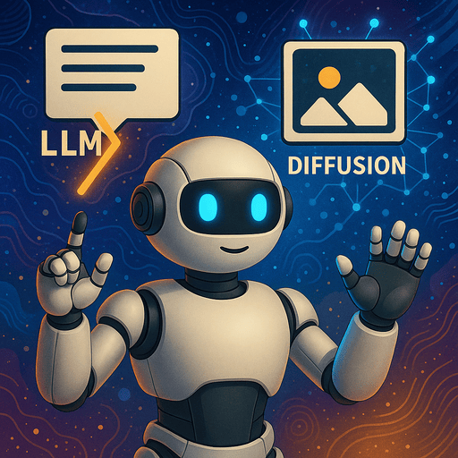

# Practical Generative AI: Building and Deploying Custom Applications

## 🧭 Lab Overview

Welcome to the **Generative AI Workshop** — a hands-on experience where you'll build a complete, interactive generative AI application from scratch. Using pre-trained large language models, vision models, and diffusion-based image generators, you'll gradually construct a storytelling app that transforms into a rich, multimodal user experience.

This course focuses on creativity, iteration, and practical deployment. Each lab adds new capabilities to your project — from generating text and analyzing images to deploying an interactive Gradio interface.

### Lab 1 – [Run Your First Language Model](01-first-language-model)

Connect to a virtual machine and run your first large language model. You'll experiment with talking to it, try out different models, and benchmark their performance.

### Lab 2 – [Turn Your LLM into a Storyteller](02-storytelling-assistant)

Explore how to guide a large language model by writing system and user prompts. By the end, you'll have built a storytelling assistant that can generate creative stories based on your own ideas and style.

### Lab 3 – [Add an Image to Guide the Story](03-add-input-image)

Learn how to use images as input for generative AI — first to describe or classify them, and then to guide a story created by a large language model.

### Lab 4 – [Chain Model Calls to Build Multi-Part Stories](04-multi-part-stories)

Use the LLM more creatively by calling it multiple times: first to generate a table of contents, then to write individual story chapters. Structure your code as a pipeline of prompts and outputs.

### Lab 5 – [Illustrate the Story with Generated Images](05-generated-images)

Bring your AI-generated stories to life by adding custom illustrations using a diffusion model. First, you’ll explore how to generate images from text, and then you’ll combine everything into a single system that creates both story and visuals together.

### Lab 6 – [Build a Simple Gradio App](06-simple-gradio-app)

Build simple Gradio web apps that connect user inputs to language and vision models, enabling real-time AI-powered interactions. You create apps for text generation, image generation, image analysis, and even a stateful chatbot — all running locally on your virtual machine.

### Lab 7 – [Create an Interactive Storytelling App](07-interactive-app)

Turn the storytelling project into a full interactive Gradio application. Let the user make decisions between chapters that guide the story’s direction. Automatically generate chapter text and branching choices.

### Lab 8 – [Explore Other Modalities](08-other-modalities)

Broaden your generative AI toolkit by experimenting with additional input and output modalities beyond text and images. In this final lab, you’ll explore new types of models — such as **speech-to-text**, **music generation** and **document question answering**.

## 🚀 Goal of the Workshop

By the end of these labs, you'll have built and deployed a complete generative AI application that:

- Generates stories using **large language models**
- Understands and uses **images as input**
- Creates custom illustrations with **diffusion models**
- Offers an interactive storytelling experience through a **web interface**

You'll also gain practical experience with tools like **Ollama**, **Hugging Face Transformers**, **Stable Diffusion**, and **Gradio** — running entirely on a GPU-powered Linux virtual machine through VS Code.

## 🛠️ Prerequisites

- Basic Python scripting (functions, variables, loops)
- Familiarity with Jupyter Notebooks
- Some exposure to how ML models are used
- No need to train your own models — all are pre-trained and ready to use

