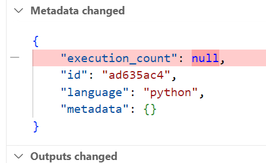

## Lab 01 – Running the Notebook


> Set up a virtual machine, configure your Python environment, and run a notebook that trains a MobileNet classifier on grocery item images.

Welcome to the starting point of your machine learning journey.

In this exercise, you'll:

* Connect to your development virtual machine.
* Set up a Python virtual environment.
* Install the Python dependencies.
* Run the Jupyter Notebook that trains a MobileNet classifier on grocery item images.

### Set up Visual Studio Code with Remote SSH


You can connect to the VM using regular SSH in a terminal, but for this course, we recommend using **Visual Studio Code’s Remote SSH** feature, which gives you access to both the terminal and file system directly inside the editor.

* Open **Visual Studio Code** on your local machine.
* Install the **Remote - SSH** extension (if not already installed).
* Click the **blue or green button in the bottom left corner** and choose **“Connect to Host…”**.
* Enter your SSH target, for example:

  ```
  root@your-vm-ip
  ```

* If it asks **where to store your SSH configuration** – just pick the **first option**.
* Once connected, VS Code will open a **remote window** linked to your virtual machine.
* It will ask **what operating system the remote machine is** – choose **Linux**.
* VS Code may ask you if you **trust the remote machine** – click **Yes**.
* Finally, it will ask for the **password**.

Note: If you prefer the command line or want to quickly check VM access, you can also SSH from your terminal using `ssh root@ip-address`.

### Clone the course repository

Once you're connected to the remote machine via VS Code:

* Open the terminal by clicking on **"View" → "Terminal"** in the top menu.
* This will open a terminal window at the bottom of the VS Code interface.

Then run the following command to clone the course repository:

```bash
git clone https://github.com/AlexanderDhoore/<date>-mlops-workshops.git
```

Replace `<date>` with the actual date of your workshop.

This will download all course materials onto your virtual machine.

**After cloning**, to open the folder in **VS Code**:

* Click on **"File" → "Open Folder..."**
* Navigate to the cloned folder: `/root/<date>-mlops-workshops`
* Click **"OK"**
* VS Code may ask you if you **trust the authors** of this folder – just click "Yes"

This will load the repository into your VS Code workspace so you can explore and edit files easily.

### Navigate to the first exercise folder

Inside the project, navigate to:

```
ml-infrastructure/01-running-the-notebook/
```

Here you’ll find a training notebook that we’ll use in the next step.

### Set up the Python environment in VS Code


Open the notebook file `grocery-store.ipynb` in VS Code and **try running the cells**.


When you try to run a cell, VS Code may prompt you to install recommended extensions like **Python** and **Jupyter**. Go ahead and install them if prompted.

Then, VS Code will ask you to **choose a kernel source**. Choose:

➡️ **Python Environments** → **Create Python Environment**

Follow these steps:

1. **Select `Venv`** – this creates a `.venv` folder in your current workspace.
2. **Choose the `/bin/python3` interpreter** – usually something like **Python 3.11**.
3. **For dependencies**, select the `requirements.txt` file inside the `01-running-the-notebook` folder.
4. Click **“OK”**.

VS Code will now automatically create a virtual environment and install all required dependencies.


### 💡 Note for advanced users

If you prefer to set up the environment manually via the terminal, you can do so:

```bash
python3 -m venv venv
source venv/bin/activate
pip install -r requirements.txt
```

Then reopen the notebook and select this virtual environment as your kernel (top-right of the notebook).

### Run the notebook


Once the installation is complete, try running the notebook cells again.


You should now see:

* A **training loop** using MobileNetV3.
* Output showing training loss and validation accuracy.
* Some **example predictions** visualized inline.

Congratulations! You've just trained and evaluated an image classifier.

### See what changed in the notebook

Before moving on, let’s take a moment to look at what actually changed when you ran the notebook.

If you haven't already, **save the notebook. CTRL+S**

Using the VS Code interface:


1. Click on the **Source Control** icon in the left-hand sidebar (the one that looks like a branch or Y-shape).
2. You’ll see one or more **pending changes** listed — most notably, `grocery-store.ipynb`.
3. Click on the notebook file in the list to see a **visual diff**.

VS Code will show you what changed inside the notebook:



* Execution counts
* Metadata like timestamps or kernel info
* Cell outputs (e.g. training progress, printed results)

Even though you **didn’t change your actual code**, you’ll see a **lot of noise** in the diff. This is a great example of why notebooks are hard to track with Git. In fact, VS Code is already doing you a favour here — it shows a **clean, human-readable view** of the notebook diff.

Behind the scenes, notebooks are saved as **large JSON files**. These aren't easy to read or version properly. So while VS Code makes it look manageable, the actual file format is much messier.

### 🧠 Viewing the Raw Notebook Diff

Now open a **terminal**. To see what the notebook file really looks like under the hood, run:


```bash
git diff
```

- Press the key "d" a few times to go **down** in the diff.
- Press the key "q" to **quit** the diff.

This shows the raw contents of the `.ipynb` file — which includes not just your code, but all kinds of metadata, and even full image outputs as **base64** strings. It’s verbose and often unreadable.

This reinforces why we’ll soon move from notebooks to Python scripts: plain `.py` files produce much cleaner diffs, are easier to version, and don’t clutter your Git history with unrelated noise.

### 🎁 Bonus Exercise

#### Use `nbdime` for cleaner notebook diffs (Optional)

If you want a more readable diff for notebooks on the command line, try using `nbdime`:

```bash
source .venv/bin/activate
pip install nbdime
nbdime config-git --enable
git diff
```

For more information, visit the documentation: [https://nbdime.readthedocs.io](https://nbdime.readthedocs.io)
