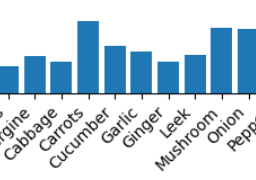
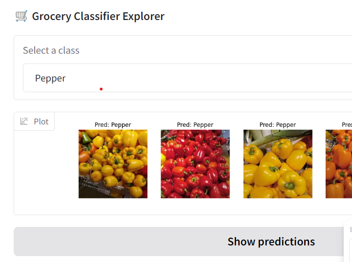

## Lab 03 – Notebook Visualization


> Use Jupyter notebooks to explore model behavior, identify weak spots, and inspect dataset structure. No training is performed here — just analysis and visualization.

### 🧭 Objective

In the previous lab, you refactored your code into clean Python modules and created a training notebook (`grocery-store.ipynb`) that loads modules, trains a model, and visualizes a few predictions.

In this lab, you’ll go one step further: use **dedicated notebooks** to explore specific aspects of your model and dataset.

These notebooks:

* **Do not train anything**
* Assume you’ve already trained and **saved a model** using `run_training.py`
* Use your **Python modules** to load data and models
* Focus on interactive, exploratory **analysis**

By keeping notebooks **small and focused**, you make your project easier to debug and extend.

```
├── 03-notebook-visualization/dataset_analysis.ipynb
└── 03-notebook-visualization/prediction_gallery.ipynb
```

Each notebook has a single goal. You can keep adding more notebooks later — thanks to your modular codebase, it’s easy.

### 🍓 Notebook 1 – `dataset_analysis.ipynb`



Use this notebook to inspect your dataset’s structure and **class imbalance**. Look at:

* Number of images per class (bar plot)

This helps answer:

* Are there more apple images than kiwi?
* Are some classes extremely rare?

Steps:

* Load the `train.txt` or `val.txt` dataset CSVs
* Group and count samples per class
    - You can use the `pandas` library, if you know it
    - Otherwise just use pure Python code (loops)
* Visualize class counts as a bar chart
    - Use `matplotlib` to draw a `plt.bar()` graph

### 🤖 Notebook 2 – `prediction_gallery.ipynb`



Use the [Gradio](https://gradio.app/) library to create a UI that lets you:

* Select a class (e.g. “fruits”)
* Show a few images from that class
* Run your model on them and display the predictions

This notebook creates a **mini demo** of your model — useful for presentations, quick tests, or debugging.

Steps:

* Install Gradio: `pip install gradio`
* Fix the TODO in the code (IP address)
* Try the demo inside the notebook (or in your browser)
