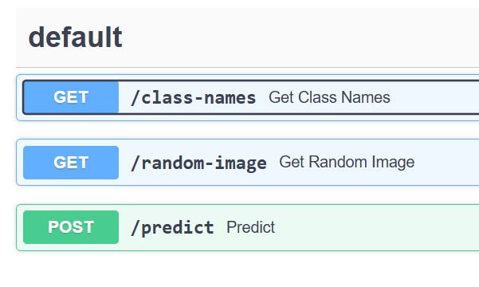
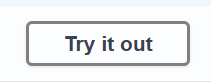

## Lab 04 – Backend with FastAPI


> Serve your trained model through a REST API built with FastAPI. Create an endpoint that accepts image uploads and returns predictions.

In this lab, you’ll **wrap your trained model into a REST API** using [FastAPI](https://fastapi.tiangolo.com/), a modern and fast web framework for building APIs in Python. This allows your model to be queried over HTTP — by other apps, frontends, or users.

You’ll build an API with three endpoints:

1. `GET /class-names` – return a list of class labels
2. `GET /random-image` – return a random sample image from the dataset
3. `POST /predict` – accept an image and return the model’s prediction

Your job is to complete `/class-names`. The endpoints `/random-image` and `/predict` are already implemented for you.

### 🧭 Step 1 – Start the FastAPI Backend

We’ve already provided a `backend.py` file inside this folder. **Let’s run it!**

#### ✅ Start the FastAPI dev server

In the terminal, begin by installing `fastapi`:

```bash
source .venv/bin/activate
pip install fastapi[standard]
```

Once installed, run the fastapi server with:

```bash
cd ml-infrastructure/04-backend-with-fastapi
fastapi dev backend.py --host 0.0.0.0
```

#### 📖 What does this command do?

* `fastapi dev` — launches the development server with auto-reload
* `backend.py` — this is the entrypoint that defines your API
* `--host 0.0.0.0` — makes the API accessible from other devices (e.g. your browser)

Once the server is running, it should print something like:

```
INFO   Uvicorn running on http://0.0.0.0:8000 (Press CTRL+C to quit)
INFO   Started reloader process [23543] using WatchFiles
INFO   Started server process [23570]
INFO   Waiting for application startup.
INFO   Application startup complete.
```

### 🌐 Step 2 – Open the Swagger UI



Open your browser and go to:

```
http://<your-vm-ip>:8000/docs
```

This opens the **Swagger UI** — an interactive page where you can explore and test the API.

You should see three endpoints:

* `GET /class-names`
* `GET /random-image`
* `POST /predict`



Open `GET /class-names`, press **"Try it out**" and select **"Execute"**

You’ll see it doesn’t work yet. The **"Response body"** is `null`.

Let’s fix that.

### 🛠️ Step 3 – Implement `/class-names`

Open the `backend.py` file. You’ll find a `TODO` for the endpoint you need to finish.

This endpoint should return a list of the model's class labels.

Look at this line at the top of the file:

```python
class_names = get_classes()
```

This is a dictionary mapping integer labels to class names, like `{0: 'apple', 1: 'banana', ...}`

You need to return a JSON response like this:

```json
{ "classes": ["apple", "banana", "milk"] }
```

When you have fixed the code, **verify that `GET /class-names` works** through Swagger UI.

### 🤖 Step 4 – Run a Prediction

The `POST /predict` endpoint is already complete.

In Swagger UI:

- Get a **sample image** from the `GET /random-image` API.
- Save it to disk and then upload it to `POST /predict`.

You should see a response like:

```json
{ "prediction": "milk" }
```

Behind the scenes, the image is passed to the model, which returns the predicted class label.
