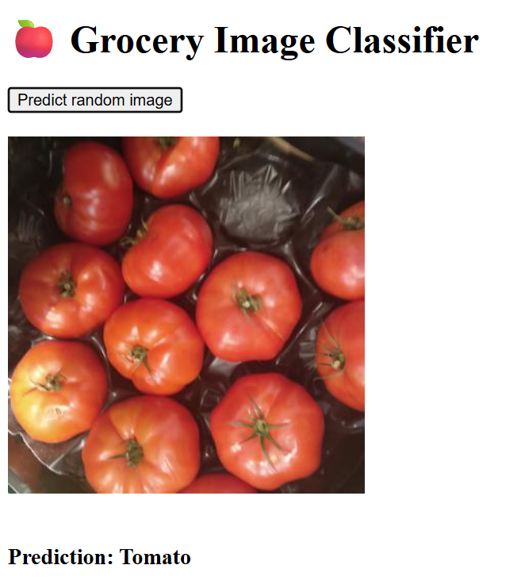

## Lab 05 – Connect the Frontend


> Integrate a Dash-based frontend with your API. Let users upload images and see model predictions in a simple web interface.

### 🧭 Goal

In the previous lab, you built a working **FastAPI backend** that serves predictions using your trained model.

In this lab, you’ll build a lightweight **frontend** using [Plotly Dash](https://dash.plotly.com/). This web app will:

* Display a random image from your dataset (served by the backend),
* Send it to the prediction endpoint,
* Show the predicted class label below the image.

The frontend acts as a **user interface** for your machine learning model — and it's a big milestone: you now have a complete system with both backend and frontend!

### 🛠️ Step 1 – Run the Frontend

The frontend is a simple Python script using **Plotly Dash**, which runs a small web server on port **8050**.

#### ✅ 1. Install required packages

If you haven’t installed Dash yet, run this inside your virtual environment:

```bash
source .venv/bin/activate
pip install dash
```

#### ✅ 2. Make sure your backend is running

You should already have your FastAPI backend from Lab 04 running on port **8000**.

If not, navigate back to `04-backend-with-fastapi` and start it again:

```bash
fastapi dev backend.py --host 0.0.0.0
```

You can confirm it's running by visiting:

```
http://<your-vm-ip>:8000/docs
```

Make sure the `/predict` and `/random-image` endpoints are available.

#### ✅ 3. Run the frontend

Now open a second terminal and run the frontend:

```bash
source .venv/bin/activate
cd ml-infrastructure/05-connect-the-frontend/
python3 frontend.py
```

You’ll see output like:

```
Dash is running on http://0.0.0.0:8050/

 * Serving Flask app 'frontend'
 * Debug mode: on
```

Open this address in your browser (your VM’s IP on port `8050`):

```
http://<your-vm-ip>:8050
```

### 🐞 Step 2 – Trigger the Error

You’ll see a simple web interface with a single button: **"Predict random image"**.

Try clicking it.

❌ You should get an error. Why?

Because the function that fetches a random image from the backend **hasn’t been implemented** yet.

The frontend is looking for an image from:

```
GET /random-image
```

But the function `get_random_image()` in `frontend.py` is currently empty — your job is to fix it.

### 🧠 Step 3 – Implement the GET Request

Open `frontend.py` and scroll to this part:

```python
def get_random_image(): # TODO
```

You’ll need to:

1. Send a `GET` request to `http://localhost:8000/random-image`
2. Return the image content as `bytes`

You can use the [`requests`](https://requests.readthedocs.io/en/latest/) library — it’s one of the most popular and useful Python libraries for HTTP requests.

#### 💡 Quick Hint

Here’s a general example of how a GET request works:

```python
import requests
response = requests.get("http://some-url.com")
response.raise_for_status()  # raises an error if the request failed
data = response.content  # raw bytes
```

Use this pattern to complete the `get_random_image()` function.

### ✅ Step 4 – Test It



Once you've implemented the request:

* Restart your `frontend.py` script,
* Refresh your browser tab,
* Click **"Predict a random image"** again.

If it works, you’ll see:

* A new image loaded from the backend,
* A prediction label shown below it.

🎉 That means your frontend and backend are successfully talking to each other!

### 🛑 Stop Frontend and Backend

Before moving on to the next exercise, it's best to **stop both frontend and backend**.

You do this in the terminal with **CTRL + C**.
