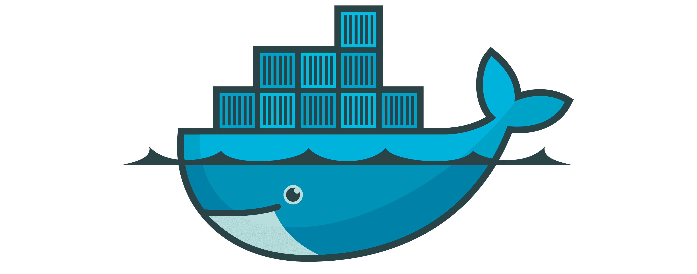

## Lab 06 – Docker Containers



> Package both the backend and frontend into Docker containers to ensure reproducibility and portability across systems.

### 🧭 Goal

In this lab, you’ll containerize your **FastAPI backend** and **Dash frontend** using Docker. By the end of this exercise, you’ll have two separate containers — one for serving model predictions, and one for displaying the UI — communicating with each other inside a Docker network.

No more "it works on my machine." Once this is done, it’ll work anywhere.

### 📁 Folder Structure

```
06-docker-containers/
├── backend/
│   ├── Dockerfile         # Pre-filled, just fix CMD
│   ├── requirements.txt   # Already complete
│   └── ❗ Your code files: backend.py, model_utils.py, data_utils.py, model.pth
├── frontend/
│   ├── Dockerfile         # Pre-filled, just fix CMD
│   ├── requirements.txt   # Already complete
│   └── ❗ Your code file: frontend.py
```

✅ You will **not** write the Dockerfiles or requirements files from scratch — they are already provided.
🛠️ You **will** fix the `CMD` at the bottom of each Dockerfile and **copy your own Python files** into the correct subfolders.

### ✅ Step 1 – Copy in your application code

Copy the following files into the right locations:

| File             | Where to put it                  |
| ---------------- | -------------------------------- |
| `backend.py`     | `06-docker-containers/backend/`  |
| `model_utils.py` | `06-docker-containers/backend/`  |
| `data_utils.py`  | `06-docker-containers/backend/`  |
| `model.pth`      | `06-docker-containers/backend/`  |
| `frontend.py`    | `06-docker-containers/frontend/` |

You should now have all required code inside the `backend/` and `frontend/` folders.

### ✅ Step 2 – Fix the backend Dockerfile

Open `backend/Dockerfile` and scroll to the bottom.

Replace this line:

```dockerfile
CMD ["???"]
```

With the correct command to run the FastAPI backend.

### ✅ Step 3 – Build and run the backend

In your terminal, build and run the backend container:

```bash
cd backend
docker build -t grocery-backend .
docker run -d --name backend -p 8000:8000 grocery-backend
```

Here’s what each command does:

* `cd backend`: navigates into the backend folder where your Dockerfile lives.
* `docker build -t grocery-backend .`: builds a Docker image from the current directory and tags it as `grocery-backend`.
* `docker run -d --name backend -p 8000:8000 grocery-backend`: runs the container in detached mode (`-d`), names it `backend`, and maps port 8000 of your virtual machine to port 8000 of the container.

Now open your browser and go to:

```
http://<your-vm-ip>:8000/docs
```

If everything worked, you’ll see the **Swagger UI**. Try the `/predict` endpoint using an image from your dataset.

### 🔍 Check Running Containers with `docker ps`

To verify that your backend container is running, use the following command:

```bash
docker ps
```

This will show a list of all active containers. You should see a row for `grocery-backend`, including its container ID, the image name, and the port mapping (e.g. `0.0.0.0:8000->8000/tcp`).

If nothing shows up, it likely means your container failed to start. Run `docker logs backend` to see the output and diagnose the issue.

### ✅ Step 4 – Fix the frontend Dockerfile

Open `frontend/Dockerfile` and scroll to the bottom.

Replace this line:

```dockerfile
CMD ["???"]
```

With the correct command to run the frontend application.

### ✅ Step 5 – Build and run the frontend (attempt 1)

In your terminal:

```bash
cd frontend
docker build -t grocery-frontend .
docker run -d --name frontend -p 8050:8050 grocery-frontend
```

Then visit:

```
http://<your-vm-ip>:8050
```

Click the **"Predict random image"** button.

🧱 **Oops!**
It doesn’t work. The frontend can’t connect to the backend — because each container runs in isolation by default.

### 🚧 Step 6 – Fixing Frontend–Backend Communication

You’ve now built and launched both containers — but when you open the frontend and click **“Predict random image”**, ❌ it **fails**.

Why?

Because **each container runs in its own isolated environment**, and inside the frontend container, the line:

```python
API_URL = "http://localhost:8000"
```

tries to reach **itself**, not the backend.

To fix this, we need to do **two things**:

### ✅ Step 6.1 – Update the Frontend Code

The **backend is running in a separate container**, and Docker gives containers predictable names that can be used as **hostnames**.

Update the line in `frontend.py` that sets the `API_URL`. Change it to:

```python
API_URL = "http://backend:8000"
```

This tells the frontend to connect to a host named `backend` — which will work **as long as both containers are in the same Docker network** (which we’ll set up next).

### ✅ Step 6.2 – Create a Shared Docker Network

Docker provides named **user-defined networks** where containers can talk to each other by name.

Create one with:

```bash
docker network create grocery-net
```

### ✅ Step 6.3 – Remove Old Containers

Remove the previously launched containers so we can start fresh in the correct network:

```bash
docker rm -f backend frontend
```

### ✅ Step 6.4 – Rebuild the Frontend (after code change)

Since you edited `frontend.py`, rebuild the frontend image:

```bash
cd frontend
docker build -t grocery-frontend .
```

### ✅ Step 6.5 – Run Both Containers in the Network

Now relaunch both containers using the same Docker network:

```bash
docker run -d --name backend --network grocery-net -p 8000:8000 grocery-backend
docker run -d --name frontend --network grocery-net -p 8050:8050 grocery-frontend
```

### ✅ Step 6.6 – Test It

Visit your frontend in the browser again:

```
http://<your-vm-ip>:8050
```

Click **“Predict random image”**. It should now correctly load an image from the backend and show a prediction.

🎉 Success! Your containers are now working together as a complete system.

### 🧹 Clean Up Docker Containers

To finish off the lab, stop and remove your Docker containers, and clean up the Docker network:

```bash
docker stop backend frontend
docker rm backend frontend
docker network rm grocery-net
```

After stopping and removing your containers, you can confirm that everything is shut down by running:

```bash
docker ps
```

This should now return **an empty list**, meaning no containers are currently running.

### 🎉 Done!

You now have:

* A backend container running a FastAPI model server
* A frontend container running a Dash app
* Both containers talking to each other over a shared Docker network

In the next lab, you’ll simplify this setup using **Docker Compose**.
