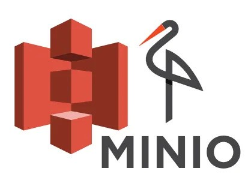

# 

Set up a local MinIO S3-compatible server. Upload your trained model to an S3 bucket and modify your API to load the model directly from S3 instead of disk. This simulates real-world production model storage.

So your fastapi has to download the model from S3 during startup.
It could even monitor S3 for new uploads, so models are auto deployed!

