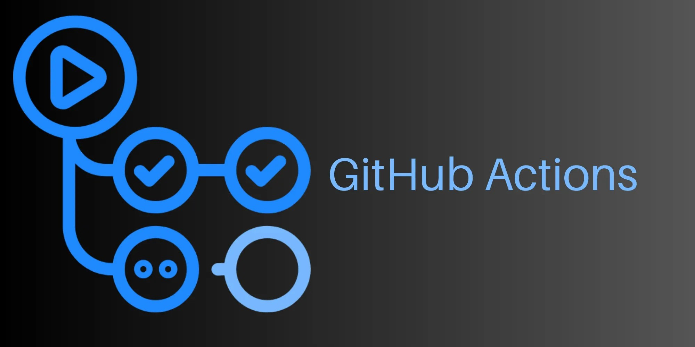

## Lab 09 – Pull Request Checks



> Add continuous integration (CI) checks to your project using GitHub Actions. Automatically test your code and check formatting every time someone opens a pull request.

In professional teams, you never merge untested code straight into `main`. You open a **pull request**, and the system **checks it automatically**:

* Does the code pass all unit tests?
* Is the formatting consistent?
* Did anything break?

These checks give your team confidence. And thanks to **GitHub Actions**, they can run every time someone pushes code — all from a simple YAML file.

### 📁 What You’ve Got in This Lab

In this folder, you'll find three key files:

| File                 | Purpose                                       |
| -------------------- | --------------------------------------------- |
| `data_utils.py`      | A (fake) helper module for loading your dataset      |
| `test_dataloader.py` | A (fake) unit test for your data loading code  |
| `checks.yml`         | A GitHub Actions workflow that runs CI checks |

Your job is to wire this all together so GitHub can run tests and formatting checks **automatically on every PR**.

### 🧩 Step 1 – Understand the GitHub Workflow

Open the `checks.yml` file and take a look:

```yaml
name: Run tests and format check

on:
  pull_request:
  workflow_dispatch:
```

This tells GitHub:

* ✅ Run this workflow **on every pull request**
* ✅ Also allow manual runs via the GitHub UI

```yaml
jobs:
  check:
    runs-on: ubuntu-latest
    steps:
```

This defines one job named `check`, running in a **fresh Ubuntu VM** provided by GitHub.

Each `step` is a command GitHub will run in order:

```yaml
- name: Checkout repository
  uses: actions/checkout@v4
```

→ Download your code into the runner

```yaml
- name: Set up Python
  uses: actions/setup-python@v5
  with:
    python-version: '3.11'
```

→ Install Python 3.11 in the runner

```yaml
- name: Install dependencies
  run: pip install black pytest
```

→ Install the two tools we’ll be using:

* `pytest`: to run your tests
* `black`: to check formatting

```yaml
- name: Run tests
  run: pytest
```

→ Run the unit tests in your repo

```yaml
- name: Check code formatting
  run: black --check .
```

→ Check whether your Python code follows the formatting rules enforced by Black (without modifying anything)

So with just a few lines of YAML, GitHub is now ready to **test and lint your code automatically.**

### 🛠️ Step 2 – Create a New Repository and Add the Workflow

Before we run any workflows, let’s first set up a new GitHub repository where all your CI checks will live.

#### ✅ Why use a new repository?

In real-world teams, pull request workflows typically run on the main project repository. But for this lab, we want to **practice in isolation** — so it’s best to create a **separate, minimal repo** just for testing and learning.

You’ll be able to break things, test changes, and reset without affecting other labs or projects.

#### 📦 Step 2.1 – Create a New Repository on GitHub

1. Go to [https://github.com/new](https://github.com/new)
2. Fill in:

   * **Repository name**: `lab9-checks` (or pick your own)
   * **Visibility**: Public (easier for testing; you can delete it later)
   * ⚠️ **Do not initialize with a README or `.gitignore`**
3. Click **Create repository**.

#### 💻 Step 2.2 – Clone the Repo on Your VM

Now switch to your virtual machine and clone the empty repo:

```bash
cd ~  # change to home directory
git clone https://github.com/YOUR_USERNAME/lab9-checks.git
```

This gives you a local folder tied to your GitHub repo.

#### ⚙️ Step 2.3 – Add the Provided Files

From the course materials (this lab folder), copy the files into your new repo:

```bash
cp 09-pull-request-checks/*.py ~/lab9-checks/
cp 09-pull-request-checks/checks.yml ~/lab9-checks/
```

Now create the folder GitHub uses for workflows:

```bash
cd ~/lab9-checks/
mkdir -p .github/workflows
mv checks.yml .github/workflows/
```

> GitHub automatically looks in `.github/workflows/` for CI/CD workflows. This folder name is **required** — don’t rename it.

#### ✅ Step 2.4 – Commit and Push to Main

Now save your changes and push them to the remote repository:

```bash
git add .
git commit -m "Add GitHub Actions workflow and test files"
git push -u origin main
```

#### 🔐 GitHub Token Setup (First-Time Push)

If this is your **first time pushing to the repo**, Git will likely ask for your **username and password**. But GitHub **no longer accepts real passwords** — you’ll need to use a **Personal Access Token** (PAT) instead.

Here’s how to create one:

1. Go to [https://github.com/settings/tokens](https://github.com/settings/tokens)
2. Click **“Generate new token (fine-grained)”**
3. Fill in:

   * **Name**: `lab9-token` or similar
   * **Expiration**: 30 days is fine
   * **Repository access**: Choose **“Only select repositories”**, then pick your new repo
   * Under **Permissions**, set:
     * ✅ `Contents`: **Read and write** (This allows updating files.)
     * ✅ `Workflows`: **Read and write** (This allows changing workflows.)
4. Click **Generate token**
5. Copy the token — you won’t be able to see it again later.

Now, when Git asks for your credentials:

* Enter your **GitHub username**
* Paste your **token** as the password

If you want Git to **remember it**, you can run:

```bash
git config --global credential.helper store
```

This saves the token **unencrypted** in a **local file** so you don’t have to paste it every time. Acceptable only for a training VM or personal environment. Although the token has very **restricted permissions** (only this repo) so the danger is quite small.

Try **updating the branch** again. Git will ask you for a username and password.

```bash
git push -u origin main

# git should ask password
```

#### 🎉 What Happens Now?

Your repo now contains:

* ✅ A test file: `test_dataloader.py`
* ✅ A module under test: `data_utils.py`
* ✅ A GitHub Actions workflow: `.github/workflows/checks.yml`

As soon as your push hits GitHub, the platform will detect the workflow file and make it available under the **Actions** tab in your repository.

But GitHub won’t run the workflow yet — because we haven’t triggered it. That’s exactly what we’ll do next.

### ▶️ Step 3 – Trigger the Workflow Manually

Let’s try running the workflow by hand first to see that everything is wired up correctly.

1. Go to your GitHub repository in the browser
2. Click the **"Actions"** tab
3. You should see a workflow called **"Run tests and format check"**
4. Click it → then click **“Run workflow”** (top right)

You should now see GitHub spin up a virtual machine, install Python, run `pytest`, and check formatting.

- If anything fails — it will show up in red ❌.
- If all is well — you’ll see green checkmarks ✅.

### 🔁 Step 4 – See It Work on a Pull Request

Time to see this in action like a real developer would — with a PR.

#### ✅ 1. Create a new branch

```bash
git checkout -b bad-format
```

#### ✅ 2. Break the formatting on purpose

Edit `test_dataloader.py`, and add a badly formatted line, like:

```python
import       sys
```

Don't run `black` — we want the workflow to catch this.

Then:

```bash
git add .
git commit -m "Introduce bad formatting"
git push --set-upstream origin bad-format
```

#### ✅ 3. Open a pull request

1. Visit your repo on GitHub
2. It should show a yellow banner: **"Compare & pull request"** — click it
3. Submit the PR from `bad-format` → `main`

GitHub will now **automatically run your workflow** and attach it to the PR.

After a few moments:

* ❌ You should see that the formatting check failed (good!)
* ✅ Now fix it by running:

```bash
black test_dataloader.py
```

Then:

```bash
git add test_dataloader.py
git commit -m "Fix formatting"
git push
```

The workflow in the pull request will re-run automatically and should now pass 🎉

### 🔒 Step 5 – Protect the Main Branch

In software projects, your `main` branch is often treated as **sacred**: it’s where the production-ready code lives. Any bug pushed directly to `main` can break your app for users, trigger failed deployments, or corrupt data. In collaborative teams, it’s crucial that no one can merge broken or untested code into this branch — not even by accident.

That’s where **branch protection rules** come in.

Branch protection is a GitHub feature that lets you enforce rules on critical branches like `main`. You can require that code reviews happen, tests pass, and branches are up to date before anything gets merged.

In this step, we’ll make sure that:

* ✅ Code **must pass all CI checks** (tests and formatting) before merging
* ✅ No one can "force push" or skip the process
* ✅ Your team — including future you — can trust the stability of `main`

#### 🛠️ How to Enable Branch Protection in GitHub

1. Open your repository on GitHub
2. Go to the **Settings** tab
3. Click on **Branches** in the left sidebar
4. Under "Branch protection rules", click **Add classic branch protection rule**

Now fill in the settings:

| Field                               | What to enter / select                                |
| ----------------------------------- | ----------------------------------------------------- |
| **Branch name pattern**             | `main`                                                |
| ✅ Require a pull request before merging     | Enabled                                      |
| ⛔️ Require approvals                 | Disabled (nobody else to approve it)                 |
| ✅ Require status checks to pass     | Enabled                                              |
| ✅ Status checks that are required   | Select your workflow (`check`)  |

Finally, click **Create** to activate the rule.

#### ✅ What This Protection Actually Does

Once enabled, this rule **blocks** anyone from merging a pull request into `main` **unless**:

* The code passes all required **status checks** (your GitHub Actions workflow),
* And (optionally) a code review is approved, if you choose to require one.

If someone tries to merge a broken branch, GitHub will stop them with a clear message — and require the issues be resolved first.

#### 💬 Why It Matters (Even on a Solo Project)

You might be thinking:

> “But I’m the only one working on this repo. Why do I need this?”

Good question — and here’s the answer:

* Branch protection is **not just about other people** — it’s about **you next week**. It helps you avoid accidentally merging something before it's ready.
* It keeps your project clean, your CI system useful, and your main branch **always deployable**.
* It also teaches you good habits that scale to any team or job, big or small.

In professional environments, these rules are standard. In this lab, you’re simulating that environment — and building the muscle memory to work like a real ML engineer or DevOps contributor.

#### 🧪 You Can Test This

Try opening a pull request from a branch with failing formatting or broken tests.

* GitHub will **prevent it from being merged**
* You’ll see a ❌ next to the checks
* Only after fixing the issues and pushing again will the PR become mergeable ✅

This gives you safety, speed, and confidence — the foundations of a mature engineering workflow.
