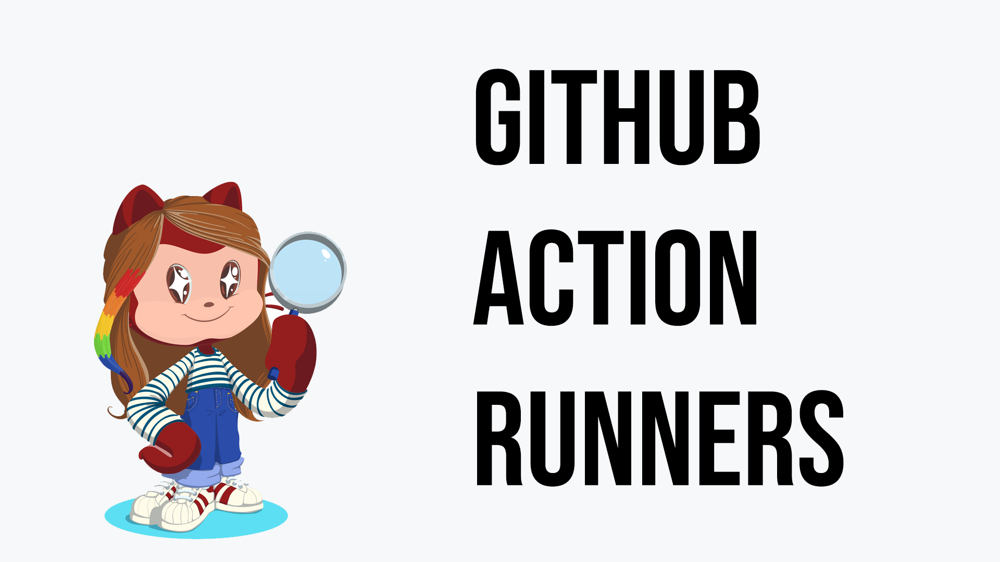
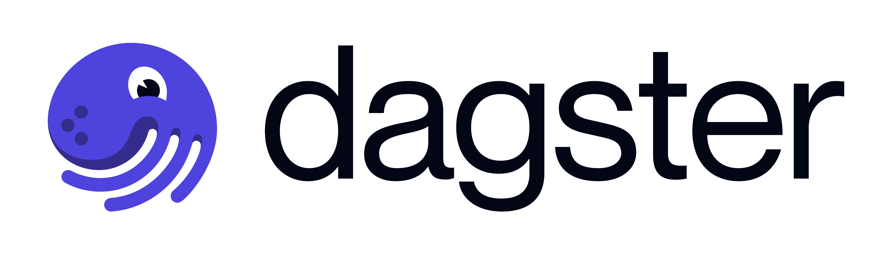

# 10 – Automatic Deployment

> Install a self-hosted GitHub Actions runner on your VM. Configure a workflow to automatically deploy your app with Docker Compose on every push to main.

Install a self-hosted GitHub Actions runner on your production VM. Configure a workflow that automatically builds and deploys your service via Docker Compose whenever changes are pushed to the main branch.

### Bonus Exercise:

#### Dagster Pipeline

> Set up Dagster to orchestrate ML pipelines: run pipelines manually or on a schedule.

Install and configure Dagster to automate your machine learning pipeline. Define a job to  retrain your model, and upload the updated model to S3. Trigger your pipeline manually or on a schedule.

- Dagster is use here for retraining only
- The code deployment still happens through github
- This is just one way of doing things, an example
